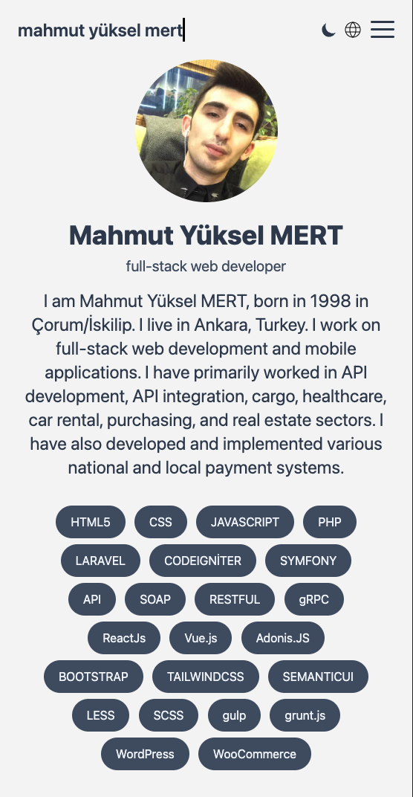
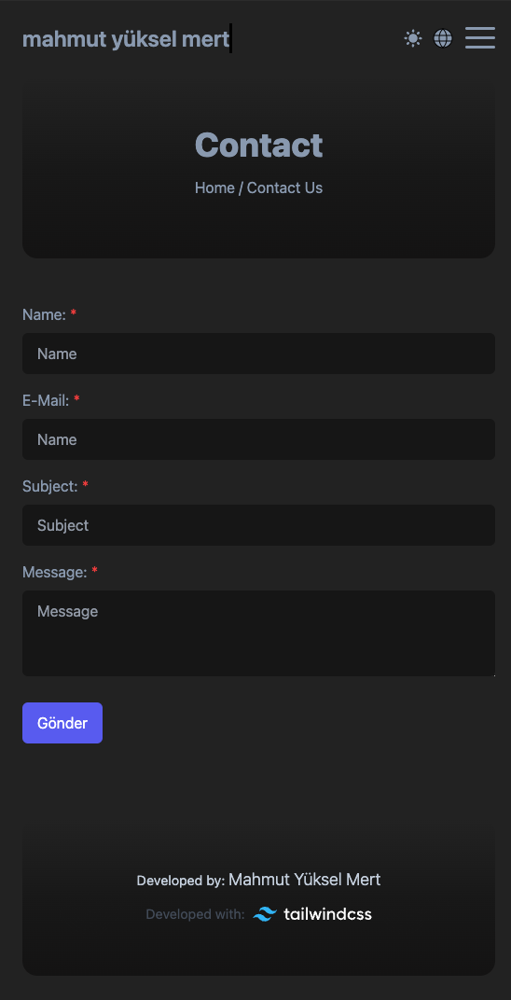

# Tailwindcss Bio Template 

I created an "About Me" template that includes a simple way to list your skills, an "About Me" page, and a contact form page. You can check it out here: [https://mahmutyukselmert.github.io](https://mahmutyukselmert.github.io). You can clone this repository to create your own page, add additional features, or contribute to my repository if you like.

## Technologies Used

 HTML5
 CSS
 SCSS
 Tailwind CSS
 Gulp.js

## How to Use?

### Installation

```sh
git clone https://github.com/mahmutyukselmert/tailwindcss-bio-template.git
```

# Prewiew Light Mode & Dark Mode

 